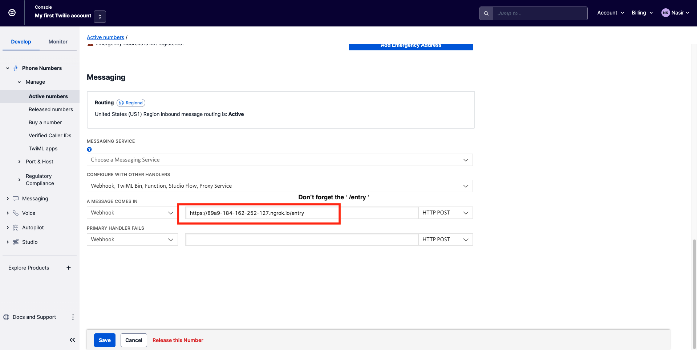

# Four O’ Four

<h3 align="center">SMS Based Headless Browsing</h3>


<p align="center">
  <a href="https://devpost.com/software/four-o-four"></a>
</p>


## Deploy locally 

### Local setup

After creating a conda/pyenv environment for the project perform the following actions

```
git clone https://github.com/Zafirmk/ConUHacksVI.git
cd ConUHacksVI
pip install -r requirements.txt
python main.py
```

Open a seperate terminal window and run the following command

```
ngrok http 4545
```

Then copy the "Forwarding" https address and replace the ngrok_url variable in main.py with it


```python
ngrok_url = 'https://89a9-184-162-252-127.ngrok.io' # REPLACE THIS WITH YOUR FORWARDING URK
```

Restart the flask server by rerunning the main.py file

Send SMS messages on the following number
```
+1 (804) 567-8399
```

### Twilio setup

Head to Twilio console and select an actie number - click on it and under "Configure" scroll to the bottom. In "Messaging" replace the "A Message comes in" webhook with the same forwarding URL as your set ngrok_url BUT ALSO APPEND '/entry' to it. Click save and it should look like the image below



### Test

Send a text to the activate number and the system should be up and running


## Commands

In the following table any text starting with '$' is a variable set by the user

| Command                       | Description                                                                                      |
|-------------------------------|--------------------------------------------------------------------------------------------------|
| instagram $USERNAME $PASSWORD | Will log in to instagram and return image of the feed                                            |
| google $SEARCHQUERY           | Will google search and return image                                                              |
| inspect $URL                  | Will load a webpage and return the endpoints webpage contacts during lifecycle                   |
| set $TAG $URL                 | Will save the url in to variable tag. Essentially turning $TAG in to a command that fetches $URL |
| $URL                          | Will return the webpage                                                                          |
| scroll                        | Will scroll down on last page loaded by user (Limited to 3 scrolls per page for demo)            |
